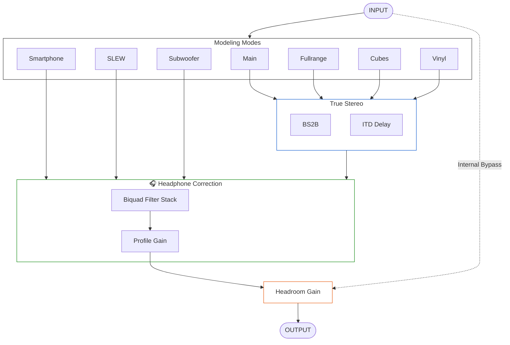

# Roof|control
### A lightweight headphone monitoring system for REAPER

Hi everyone!

I'm a mixing engineer. In late 2025, I moved from Russia to Serbia, where I planned to build my new home studio. As is often the case, construction got delayed, and I was forced to switch to monitoring exclusively on headphones. Honestly, I’ve never been a fan of that idea, but I had no choice. Working "raw" in headphones felt impossible for me, so I started looking for a solution.

I own licenses for several commercial monitoring plugins, but I really wanted a native, lightweight Linux solution. Ultimately, I took the algorithms that worked best for me, combined them into a single JSFX plugin, and added the specific features I needed for my daily workflow.

---

<p align="center">
  
</p>

---

## What makes it different?
Roof|control combines headphone correction, crossfeed with adjustable ITD, and mix translation emulation into a single lightweight JSFX chain designed specifically for REAPER monitoring FX.

### Video Demo & Audit Example
[](https://www.youtube.com/watch?v=u_sbqv-6IHA)

*The video is in Russian, but I've provided full English subtitles.*

## Main Modules

### 1. Speaker Emulation Module
Lets you quickly check your mix across various playback systems:
* **Main Monitors** – Transparent mode with no processing. This is the primary mode for mixing.
* **Cubes** – Custom emulation of the famous Auratone "mix cubes."
* **Vinyl** – A faithful recreation of the mode found in AirWindows Monitoring 3.
* **Smartphone** – Mobile speaker simulation (from Monitoring 3).
* **SLEW** – (The mysterious device on the right side of the desk) A detector for "fast" events in the mix. Great for identifying transient-related issues (from Monitoring 3).
* **Subwoofer** – A recreation of the Monitoring 3 mode for checking low-end conflicts.
* **Fullrange** – A custom mode I built by combining modes 1 and 6 (activated by clicking on the central control deck). It mimics the feel of home theaters or club systems.

### 2. Headphone Correction Block
The plugin uses profiles from the AutoEQ project (though you are free to use your own measurements).

### 3. True-Stereo Block
Based on the well-known BS2B project, but with one significant modification. The original author of BS2B intentionally omitted a delay for the crossfeed signal. I have added an **ITD (Interaural Time Difference)** parameter, which significantly improves stereo naturalness and creates a more speaker-like stereo image.

> **Note:** This module is active only for the following modes: Main, Cubes, Vinyl, and Fullrange.

---

## Installation

1. **Download:** Get the latest release from the [Releases page](https://github.com/Ilya-audio/roof_control/releases).
2. **Install:** Extract the contents into your **REAPER Resource Path**.

⚠️ Important: Directory Structure

The directory structure must match the example below. If your structure differs from the reference, correct operation is not guaranteed.

<details>
<summary><b>📂 Click to view Directory Structure </b></summary>
  
```
REAPER/ (Resource Path)
├── Data/
│   ├── roof_control/
│   │   ├── gui/
│   │   │   ├── background.png
│   │   │   ├── background_dark.png
│   │   │   ├── bypass.png
│   │   │   ├── bypass_select.png
│   │   │   ├── config.png
│   │   │   ├── cubes.png
│   │   │   ├── cubes_on.png
│   │   │   ├── fullrange.png
│   │   │   ├── fullrange_on.png
│   │   │   ├── fullrange_select.png
│   │   │   ├── main.png
│   │   │   ├── main_on.png
│   │   │   ├── slew.png
│   │   │   ├── slew_on.png
│   │   │   ├── smartphone.png
│   │   │   ├── smartphone_on.png
│   │   │   ├── sub.png
│   │   │   ├── sub_on.png
│   │   │   ├── vinyl.png
│   │   │   └── vinyl.png
│   │   └── phones_eq/     
│   └── toolbar_icons/      
│       ├── toolbar_roof_control_cube.png
│       ├── toolbar_roof_control_full.png
│       ├── toolbar_roof_control_main.png
│       ├── toolbar_roof_control_slew.png
│       ├── toolbar_roof_control_smartphone.png
│       ├── toolbar_roof_control_sub.png
│       └── toolbar_roof_control_vinyl.png
├── Effects/
│   └── roof_control/
│       └── roof_control    
└── Scripts/
    └── roof_control/       
        ├── roof_bubrik.lua
        ├── roof_control_bypass.lua
        ├── roof_control_cubes.lua
        ├── roof_control_enable.lua
        ├── roof_control_fullrange.lua
        ├── roof_control_main.lua
        ├── roof_control_slew.lua
        ├── roof_control_smartphone.lua
        ├── roof_control_subwoofer.lua
        └── roof_control_vinyl.lua
```
</details>

3. **Set up your headphone profile:**
    * Go to [autoeq.app](https://autoeq.app) and find your headphone model.
    * In the **Select Equalizer App** dropdown, choose **Custom Parametric EQ**.
    * Adjust filters: AutoEQ defaults to 5; I recommend setting this to 10 for better accuracy.
    * Download the `.txt` profile and place it into: `*reaper resource folder*/Data/roof_control/phones_eq`.
4. **Run Backend:** Go to the "Actions" menu, add and run the `roof_bubrik.lua` satellite script. 
    * *Note: JSFX has limited file-handling, so this script is essential. If you use SWS, add it to your startup actions.*
5. **Load Plugin:** Add **JS: roof|control** in the **Monitoring FX** section AFTER all your meters (not on Master-track).

⚠️ Please ensure that both the Monitoring FX chain and the plugin are NOT bypassed before loading profiles. To initialize correctly, both the plugin and Mon FX MUST be active. That's just a Reaper engine thing :)

---

## Optional: Toolbar Setup

For a seamless workflow, you can create toolbar buttons to switch monitoring modes instantly without opening the plugin interface.

* **Included Scripts:** The package includes individual scripts for each mode (`MAIN`, `SUBWOOFER`, `SLEW`, `CUBES`, `SMARTPHONE`, `VINYL`, `FULLRANGE`).
* **Setup Instructions:**
    1. Open the **Actions List** in REAPER and import all scripts starting with `roof_control_`.
    2. Right-click your desired Toolbar -> **Customize Toolbar**.
    3. Add these actions as buttons.
    4. **Visual Feedback:** The buttons will light up to show the currently active mode, staying perfectly in sync with the plugin.
    5. **Custom Icons:** The package also includes **custom icons** for your toolbar to match each monitoring mode visually.
  

---

## Fine-tuning

* **Configuration:** Click the headphone on the desk to select your profile.
* **Preamp:** Uses the AutoEq profile preamp as filter headroom. RCC adds post-filter makeup limited by the global headroom value, so toggling correction stays close in level without defeating clipping protection.
* **True Stereo Setup:**
    1. Send only the Left or Right channel into the plugin.
    2. Adjust the **cutoff** until you achieve a comfortable tone.
    3. Switch back to stereo and adjust **suppression**.
    4. Send only the Left or Right channel into the plugin.
    5. Gradually increase the **ITD** to open up the soundstage.
    * *My sweet spot: cutoff 800, suppression 6 dB, ITD 0.12 ms.*

## Technical Notes
* File operations and toolbar switching require the `roof_bubrik.lua` script to be running.
* Global Synchronization (gmem):
The plugin is designed to function as a single, unified monitoring hub. Because of the external control system (which allows you to switch modes via toolbar buttons or scripts), all instances of the plugin will stay synchronized. You only need one copy of the plugin in your Monitoring FX chain to control your entire setup.
* REAPER Exclusive: This plugin is designed specifically for REAPER. Due to the heavy use of shared memory (gmem) and the backend script, it will not work in other JSFX hosts (like ysfx).
---
## DSP Block diagram


---
## Credits & Inspirations

Roof|control is built upon the foundation of several incredible open-source projects. Deep respect to the authors for their contribution to the audio community:

* **BS2B (Bauer stereophonic-to-binaural DSP)** — Boris Mikhailov  
  The core crossfeed approach used as the foundation for the True-Stereo processing section.

* **Airwindows plug-ins** — Chris Johnson  
  Conceptual and algorithmic inspiration for the Vinyl, Smartphone, Subwoofer, and SLEW translation modes.

---

## Support the Project

If you find **Roof|control** useful and would like to support its further development, I would be deeply grateful. 

* **Russia & CIS:** You can support the project via **[Boosty](https://boosty.to/rooftopstudio)**. This is currently the most reliable way to send a donation.
* **Rest of the World:** At the moment, there is no direct way to accept international donations due to banking restrictions. However, I am working on finding a solution. Stay tuned!

> **Note:** Every donation helps me dedicate more time to refining the algorithms and adding new features. Thank you for your support!

---
**P.S. Why the name "roof_bubrik"?**

I have a studio cat named **Bubrik**. She is in charge of comfort and constantly monitors the operating temperature of my gear. She’s a vital team member—without her, everything would fall apart. Since the background script performs a similar "maintenance" role, I decided to name it after her. :)

<p align="center">

</p>
